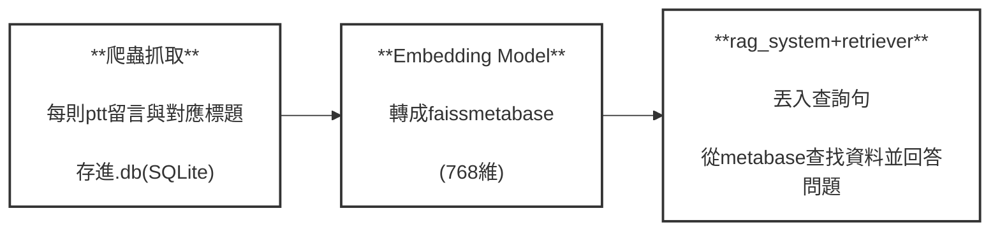

# rag_ptt
## 簡介
由於目前的語言模型如GPT, Gemini 等等對於ptt留言的資料難做到精準的內文理解。  
我希望能使用rag的技術，將ptt baseball板的鄉民留言討論帶入現成hugging face 可取用到的語言模型，讓其可以回答一些近期的鄉民留言討論內容，例如:這個XX暱稱最有可能是在討論哪位選手?  對於近期賽事網友的一些看法等等。所以試做這個專案，並依此練習rag的應用技術。
## 流程


## 詳細步驟與解釋
### (1)crawler
使用爬蟲將ptt baseball板的留言都收集下來，其中需要排除掉像是分類為[live], [公告] 的文章。這兩類的文章通常沒有什麼留言價值。  
其中會將文章標題, 留言, 讚噓->, 留言時間這幾個資料爬取下來，並在.db內建立兩個table，分別為文章、留言內容。  
### (2)comment_filter
過濾一些無用的留言如下: 
```
    # 純灌水詞列表（完全符合才刪除）
    spam_words = {
        '推', '噓', '→',
        'XD', 'XDDD', 'XDDDD',
        '笑死', '笑爛', '笑鼠',
        '樓上', '樓上正解', '同樓上',
        '+1', '+9', '++',
        '好喔', '好', '不錯', '讚', '讚啦', '贊',
        '哈哈', '哈哈哈', 'HAHA',
        '可憐', '可撥',
        '......', '…', '......',
        '？？？', '???',
        '！！！', '!!!',
        '先推', '推推', '必推',
        '優文', '好文',
        '錢', '發錢',
        '朝聖', '卡',
        '頭香', '搶頭香',
        '安安', '嗨',
        '通過', 'pass',
        '收到', 'ok', 'OK',
    }
```
  ### (3)vectorize_faiss, run_all_batch_for_vectorize
  由於資料量太大，因此將資料分批次存進faiss內，使用run_all_batch_for_vectorize執行vectorize_faiss，將.db的資料分批次存進faiss。  
  這步驟會得到兩個檔案，分別是index 以及 metabase.pkl。pkl儲存每個留言詳細的資料，像json的格式，然後index儲存的是這些資料對應的768維度的向量。  

  ### (4)complementary_retriever
  將faiss內的資料，透過retriever將faiss內metabase的資料，透過jieba斷詞，並計算好每則(標題+留言)的BM25分數，將其儲存在新的bm25.pkl內。
  第二部分就是建立bm25與faiss向量相似度的檢索規則，從相似度最高的開始排序，規則如search類別的內容
  ```
        # ========== 關鍵改動：分層收集 ==========
        tier1_bm25_high = []  # BM25 高分（最優先）
        tier2_faiss_high = []  # FAISS 高分
        tier3_bm25_med = []  # BM25 中分
        tier4_faiss_low = []  # FAISS 低分（補充）

        seen = set()  # ← 改：只存 idx，不是 (part_num, local_idx)

        # 階段 1：收集 BM25 高分
        for idx, score in bm25_results_sorted:  # ← 改：只有 idx 和 score
            if score > bm25_high_threshold:
                if idx in seen:  # ← 改：直接用 idx
                    continue

                meta = self.metadata[idx].copy()  # ← 改：直接存取 metadata
                doc_text = meta.get('combined_text', '')

                if self._is_good_match(query, doc_text):
                    meta['score'] = score
                    meta['source'] = 'bm25_high'
                    meta['reason'] = f'精確匹配 (BM25={score:.2f})'
                    meta['priority'] = 1
                    tier1_bm25_high.append(meta)
                    seen.add(idx)  # ← 改：只加 idx

        # 階段 2：收集 FAISS 高分
        for idx, score in faiss_results_sorted:  # ← 改：只有 idx 和 score
            if score > faiss_high_threshold:
                if idx in seen:  # ← 改：直接用 idx
                    continue

                meta = self.metadata[idx].copy()  # ← 改：直接存取 metadata
                meta['score'] = score
                meta['source'] = 'faiss_high'
                meta['reason'] = f'高度相關 (FAISS={score:.3f})'
                meta['priority'] = 2
                tier2_faiss_high.append(meta)
                seen.add(idx)  # ← 改：只加 idx

        # 階段 3：收集 BM25 中分
        for idx, score in bm25_results_sorted:  # ← 改：只有 idx 和 score
            if score > bm25_med_threshold:
                if idx in seen:  # ← 改：直接用 idx
                    continue

                meta = self.metadata[idx].copy()  # ← 改：直接存取 metadata
                doc_text = meta.get('combined_text', '')

                if self._is_good_match(query, doc_text):
                    meta['score'] = score
                    meta['source'] = 'bm25_med'
                    meta['reason'] = f'部分匹配 (BM25={score:.2f})'
                    meta['priority'] = 3
                    tier3_bm25_med.append(meta)
                    seen.add(idx)  # ← 改：只加 idx

        # 階段 4：收集 FAISS 補充
        for idx, score in faiss_results_sorted:  # ← 改：只有 idx 和 score
            if score > faiss_low_threshold:
                if idx in seen:  # ← 改：直接用 idx
                    continue

                meta = self.metadata[idx].copy()  # ← 改：直接存取 metadata
                meta['score'] = score
                meta['source'] = 'faiss_low'
                meta['reason'] = f'相關 (FAISS={score:.3f})'
                meta['priority'] = 4
                tier4_faiss_low.append(meta)
                seen.add(idx)  # ← 改：只加 idx
```
  ### (5)rag_system
會import complementary的 search 類別，採用BAAI/bge-base-zh-v1.5 這個embed model來對對話內的內容做embed，
並照search規則取出前二十則相關的留言內容供語言模型taide/TAIDE-LX-7B-Chat閱讀。最後讓語言模型自行回答。
  
  
  
